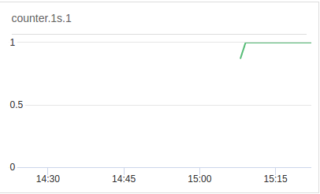
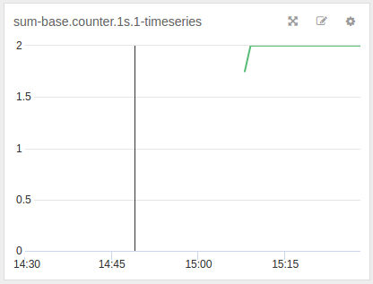
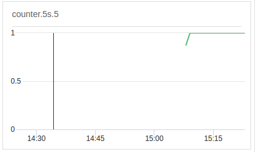
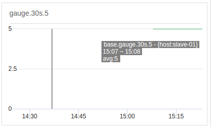

# node-statsd-base-line
> 使用 node.js 实现的 statsd 基准线

这个程序启动后会按照下表中的所有组合自动上传数据

|  类型   |  间隔   |  值    |  标签    |
| ------- | ------ |  ----- | ------- |
| gauge   |   1s   |   1    | label:a |
| counter |   5s   |   5    | label:b |
|         |   30s  |        |         |
|         |   60s  |        |         |

可用于测试和演示的目的。

## 图片示例

每 1 秒增加 1 的计数器

`avg:base.counter.1s.1`



`sum:base.counter.1s.1` 

 

-----

每 5 秒增加 5 的计数器



-----

每 30 秒上传一次 5 的标量



## 启动命令

```sh
docker-compose up -d --build
```

